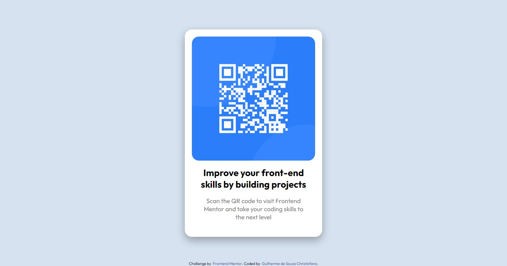

# Frontend Mentor - solução de componente de código QR

Esta é uma solução para o [desafio do componente de código QR no Frontend Mentor](https://www.frontendmentor.io/challenges/qr-code-component-iux_sIO_H). Os desafios do Frontend Mentor me ajudam a melhorar minhas habilidades de codificação criando projetos realistas. 

## Índice

- [Visão geral](#visao-geral)
  - [Captura de tela](#captura-de-tela)
  - [Links](#links)
- [Meu processo](#meu-processo)
  - [Construído com](#construido-com)
- [Autor](#autor)
- [Agradecimentos](#agradecimentos)

## Visão geral

### Captura de tela

### Links

- URL da solução: [GitHub](https://github.com/Gschristofano/challenge-qr-codde)
- Live Site URL: [Netlify](https://challengecodeqr.netlify.app/)

## Meu processo

### Construído com

- Marcação semântica HTML5
- Propriedades personalizadas do CSS
- Flexbox
- CSS Grid

## Autor

 

- LinkedIn - [Guilherme S. Christofano](https://www.linkedin.com/in/guilherme-christofano/)
- Frontend Mentor - [@Gschristofano](https://www.frontendmentor.io/profile/Gschristofano)

## Agradecimentos

Queria agradecer aos meus amigos e desenvolvedores [Gustavo Maisatto](https://github.com/gustavomaisatto) e [Fabio Pecora Lopes](https://www.linkedin.com/in/fabio-dominicheli-pecora-lopes/) por sempre me encorajar a solucionar problemas e desafios front-end, a todos os envolvidos pela ideia proposta pelo [Frontend Mentor](https://www.frontendmentor.io/) e por ultimo, mas não menos importante, aos meus professores e colegas de universidade. Obrigado!

